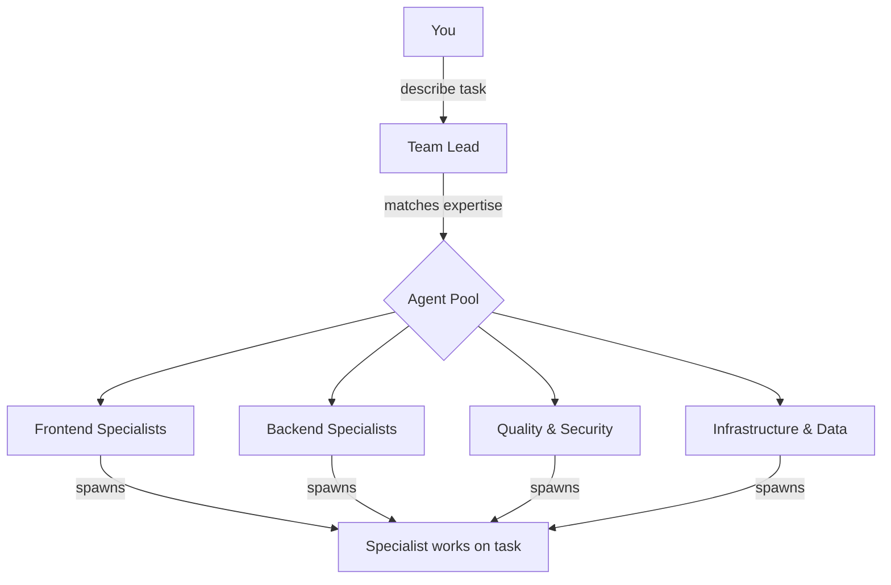

# Agent Pool

A Claude Code plugin providing a curated roster of specialist agents for Agent Teams.


## What This Is

When Claude Code's Agent Teams feature creates a team, the Team Lead spawns teammates ad-hoc. Agent Pool fills a gap: instead of inventing agents on the fly, the Lead pulls from a pre-defined pool of 12 domain specialists with proven system prompts, consistent structure, and clear expertise boundaries. Think of it as a directory of tradespeople rather than training someone from scratch each time.



## Prerequisites

- Claude Code v2.1 or later
- Agent Teams experimental feature enabled:

```bash
export CLAUDE_CODE_EXPERIMENTAL_AGENT_TEAMS=1
```

Agent Teams is an experimental feature. The environment variable must be set before starting Claude Code.

## Installation

### Development / Testing

```bash
claude --plugin-dir /path/to/agent-pool
```

Loads the plugin for the current session only. No permanent changes.

### From GitHub

```bash
git clone https://github.com/SleepyOldOrbs/tradesfolk.wilmo.co.uk.git
claude --plugin-dir ./tradesfolk.wilmo.co.uk
```

Marketplace installation will be available in a future release.

## Agent Roster

The pool contains 12 specialists grouped by domain. Each agent has a terminal colour for visual identification, a defined set of tools, and a permission mode controlling how it interacts with your codebase.

| Colour | Agent | Domain | Tools Tier | Permission |
|--------|-------|--------|------------|------------|
| Blue | `javascript-developer` | JS/TS, Node.js, build tooling, code modernisation | Implementation | default |
| Blue | `react-specialist` | React 19, Next.js 15, server components, frontend performance | Implementation | default |
| Blue | `ux-designer` | Accessibility, design systems, responsive layouts, UI/UX | Documentation | default |
| Green | `python-developer` | Python, FastAPI, Django, CLI tools, scripting | Implementation | default |
| Green | `backend-architect` | API design, system architecture, service boundaries | Implementation | plan |
| Green | `systems-programmer` | Rust, Go, C/C++, performance-critical code, concurrency | Full access | default |
| Green | `database-specialist` | Schema design, query optimisation, migrations, indexing | Implementation | default |
| Yellow | `qa-tester` | Test automation, test strategy, coverage, E2E testing | Full access | default |
| Red | `security-auditor` | Security audits, threat modelling, vulnerability assessment | Read-only | plan |
| Cyan | `devops-engineer` | CI/CD, Docker, K8s, Terraform, cloud infrastructure | Full access | default |
| Magenta | `data-scientist` | ML, data analysis, statistics, experiment design | Full access | default |
| Magenta | `technical-writer` | API docs, guides, tutorials, ADRs | Documentation | acceptEdits |

### Tools Tiers

- **Read-only** -- Read, Grep, Glob, Bash, NotebookRead
- **Documentation** -- Read, Grep, Glob, Write, Edit, Bash
- **Implementation** -- Read, Grep, Glob, Write, Edit, Bash, MultiEdit, NotebookEdit
- **Full access** -- All implementation tools plus WebFetch, WebSearch, TodoWrite

### Permission Modes

- **default** -- Standard permission checking
- **plan** -- Read-only exploration; proposes changes without making them
- **acceptEdits** -- Auto-accepts file edits (documentation-focused agents)

## Skills

Three skills are included for browsing the roster, assembling teams, and using pre-built templates.

### `/browse-pool`

View the complete agent roster grouped by domain.

```
> /browse-pool
```

Shows all 12 agents organised by category: Frontend & UI, Backend & Systems, Quality & Security, Infrastructure & Operations, Data & ML, and Documentation.

### `/assemble-team <task description>`

Get a team recommendation for a specific task.

```
> /assemble-team build a REST API with authentication and rate limiting
```

Returns a recommended team (for example: backend-architect as lead, python-developer, database-specialist, security-auditor) with reasoning for each selection and team sizing guidelines.

### `/team-templates`

Browse 7 pre-built team compositions for common scenarios.

```
> /team-templates
```

Available templates:

1. **Full-Stack Feature** -- react-specialist (lead), javascript-developer, qa-tester
2. **API Development** -- backend-architect (lead), python-developer, database-specialist, qa-tester
3. **Security Hardening** -- security-auditor (lead), backend-architect, devops-engineer
4. **Frontend Overhaul** -- react-specialist (lead), ux-designer, javascript-developer
5. **Data Pipeline** -- data-scientist (lead), python-developer, database-specialist
6. **Infrastructure Setup** -- devops-engineer (lead), systems-programmer, backend-architect
7. **Documentation Sprint** -- technical-writer (lead), backend-architect

## Workflow Examples

### Building a Full-Stack Feature

Enable Agent Teams and load the plugin:

```bash
export CLAUDE_CODE_EXPERIMENTAL_AGENT_TEAMS=1
claude --plugin-dir /path/to/agent-pool
```

Describe the task to Claude:

```
> Build a user settings page with form validation, an API endpoint for saving
  preferences, and tests for both frontend and backend.
```

The Team Lead analyses the task and selects agents from the pool. For this task it would likely spawn `react-specialist` for the settings UI, `javascript-developer` for the API endpoint, and `qa-tester` for test coverage. Each specialist receives their domain-specific system prompt and works within their defined tool permissions.

### Security Review

Use the assemble-team skill to get recommendations:

```
> /assemble-team audit our authentication flow and session management
```

The skill recommends `security-auditor` as lead with `backend-architect` for architectural context. The security-auditor operates in read-only mode with `plan` permissions -- it examines code and proposes fixes without modifying files directly. This ensures the audit is non-destructive.

### Quick Start with Templates

Browse available templates and pick one:

```
> /team-templates
```

Select a template by name or number:

```
> /team-templates API Development
```

This assembles `backend-architect` (lead), `python-developer`, `database-specialist`, and `qa-tester`. The backend-architect works in `plan` mode to design the API structure, then the implementation agents build it while qa-tester writes tests in parallel.

## Hooks

The plugin includes a `TeammateIdle` hook that provides lightweight observability during Agent Teams sessions.

When a teammate goes idle, the hook writes a log entry to stderr:

```
[agent-pool] Teammate {name} going idle
```

The hook allows the idle transition to proceed -- it is purely informational. This is useful for monitoring team activity without blocking the teammate lifecycle.

## Customization

### Adding a New Agent

1. Create a file in `agents/` with the next available number prefix (e.g., `13-my-agent.md`).

2. Include the required YAML frontmatter:

   ```yaml
   ---
   name: my-agent
   model: inherit
   color: green
   tools: Read, Grep, Glob, Write, Edit, Bash
   permissionMode: default
   description: >
     Use this agent for [tasks]. Expert in [domain].

     <example>
     Context: [situation]
     user: "[request]"
     assistant: "[delegation response]"
     <commentary>
     [Why this agent is appropriate]
     </commentary>
     </example>
   ---
   ```

3. Write the system prompt body following the three-section pattern:
   - **Core expertise** -- bullet list of specific technologies and skills
   - **Working standards** -- concrete rules the agent follows
   - **When given a task** -- numbered workflow steps

4. Include 3 `<example>` blocks in the description for delegation matching.

5. Assign a colour matching the agent's domain: blue (frontend), green (backend), yellow (quality), red (security), cyan (infrastructure), magenta (data/docs).

6. Claude Code auto-discovers agents from the `agents/` directory. No registration step is needed.

### Modifying Existing Agents

Edit the agent's `.md` file directly. Changes take effect on the next Claude Code session.

### Colour Scheme Reference

| Colour | Domain |
|--------|--------|
| Blue | Frontend & UI |
| Green | Backend & Systems |
| Yellow | Quality |
| Red | Security |
| Cyan | Infrastructure |
| Magenta | Data & Docs |

## Contributing

1. Fork the repository.
2. Follow the existing agent format: YAML frontmatter with the required fields, plus a three-section system prompt (Core expertise, Working standards, When given a task).
3. Keep agent description summaries concise (under 400 characters).
4. Include 3 `<example>` blocks per agent for delegation matching.
5. Test with `claude plugin validate` before submitting.
6. Open a pull request with a description of the new agent or change.

## License

[MIT](LICENSE)
